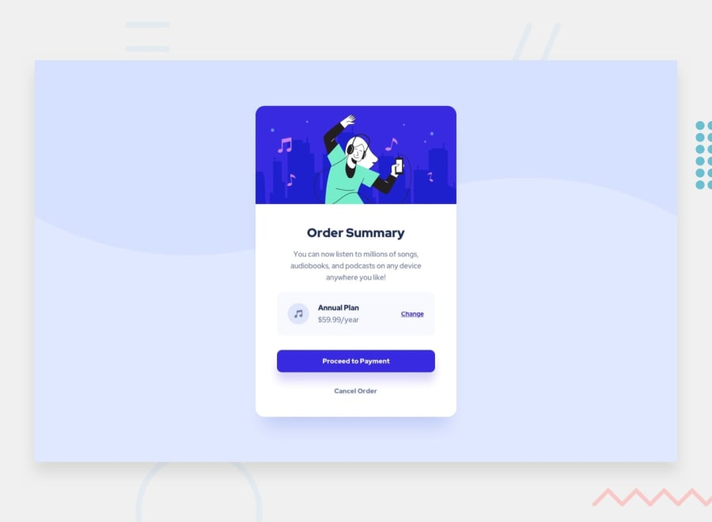

# Frontend Mentor - Order summary card solution

This is a solution to the [Order summary card challenge on Frontend Mentor](https://www.frontendmentor.io/challenges/order-summary-component-QlPmajDUj). Frontend Mentor challenges help you improve your coding skills by building realistic projects. 

## Table of contents

- [Overview](#overview)
  - [The challenge](#the-challenge)
  - [Screenshot](#screenshot)
  - [Links](#links)
- [My process](#my-process)
  - [Built with](#built-with)
  - [What I learned](#what-i-learned)
  - [Continued development](#continued-development)
  - [Useful resources](#useful-resources)
- [Author](#author)
- [Acknowledgments](#acknowledgments)

## Overview

### The challenge

Users should be able to:

- See hover states for interactive elements

### Screenshot

### Links

- Solution URL: [Repo](https://github.com/sedaryildirim/order-summary)
- Live Site URL: [Live Site](https://sedaryildirim.github.io/order-summary/)

## My process

Started with placing all html elements in correct divs, along with class ids to to move onto CSS
styling using flexbox

### Built with

- HTML5
- CSS
- Flexbox

### What I learned

- Wrap text with word-wrap: & break-word
- Better placement of <divs> to utilise flexbox

### Continued development

- Improve Flexbox Usage
- Improve shorthand knowledge
- Learn responsive layout design

### Useful resources

- [Flexbox Froggy](https://flexboxfroggy.com/) - Flexbox Tutorial
- [Kevin Powell](https://www.youtube.com/KevinPowell) - HTML & CSS tutorirals
## Author

- Github - [Sedar Yildirim](https://github.com/sedaryildirim)
- Frontend Mentor - [@sedaryildirim](https://www.frontendmentor.io/profile/sedaryildirim)

## Acknowledgments

[Frontendmentor.io](https://www.frontendmentor.io/)

[Flexboxfroggy](https://flexboxfroggy.com/)

[Kevin Powell](https://www.youtube.com/KevinPowell)